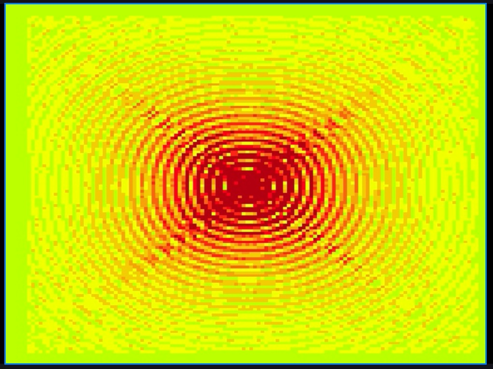
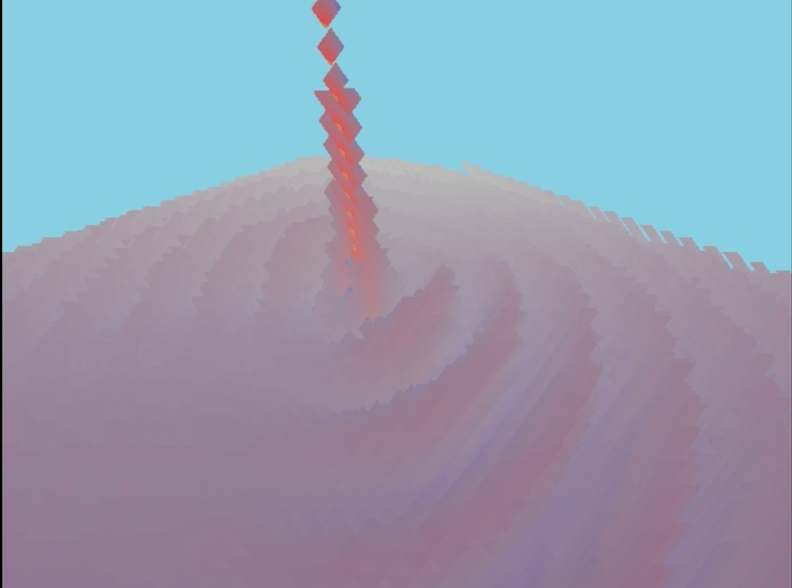

<div align="center">

# Electromagnetic FPGA 3D Renderer

### Real-time visualisation of Maxwell's equations, computed and rendered entirely on an FPGA

A live **2D Finite-Difference Time-Domain (FDTD)** electromagnetic solver running on a **PYNQ-Z1 (Zynq-7020)**, streamed directly to **HDMI at 640×480, 25 fps** — viewable either as a flat colour field or as a ray-marched 3D surface, entirely in hardware. No frame is ever computed on a CPU.

*EE2 Mathematics Accelerator Project · Imperial College London*

</div>

---

## Demonstration

<div align="center">

<!-- ───────────────────────────────────────────────────────────────── -->
<!--  UI / LIVE DEMO  — drop a screen-capture GIF or video link here.    -->
<!--  Suggested: a short clip of the HDMI output + the ESP32 touch       -->
<!--  panel dragging the source around. Replace the line below.          -->
<!-- ───────────────────────────────────────────────────────────────── -->

> **Live demo video / GIF goes here** — _placeholder: add a capture of the HDMI output and the hardware panel in use._

|  2D field view  |  3D ray-marched view  |
|:---:|:---:|
|  |  |
| Interference rings from a point source — a moving source produces a visible **Doppler** asymmetry. | The same field as a shaded 3D landscape, with a **PS-controllable orbiting camera**. |

</div>

---

## Overview

The brief asked for a real-time visualisation of a computationally intensive, embarrassingly-parallel function. Rather than a fractal, we chose something physically meaningful: **solving Maxwell's equations in time** and making the invisible electromagnetic field tangible.

A wave source is generated on-chip, propagated across a **128×128 FDTD grid** every frame, reduced to a field-magnitude heightmap, and **ray-marched per pixel** into a shaded image — the entire pipeline lives in the programmable logic. The ARM processor only sets parameters and reads back status over AXI; it never touches the field.

| | |
|---|---|
| **Board** | PYNQ-Z1 · `xc7z020clg400-1` (Zynq-7020) |
| **Output** | HDMI, 640×480 @ 25 fps |
| **Solver** | 2D FDTD (Ey/Ex/Bz), 128×128 grid, PML absorbing boundaries |
| **Renderer** | Per-pixel ray marcher (48-step), 3D heightmap surface |
| **Arithmetic** | Signed **Q3.13** fixed-point throughout (`1.0 = 8192`) |
| **Control** | Live from a **PYNQ Jupyter notebook** over AXI-GPIO |
| **HDL** | SystemVerilog / Verilog · built from a scripted **Tcl** flow · Vivado 2023.2 |

---

## Architecture

```
  CORDIC          2D FDTD            field            ping-pong         ray-march
  source   ──►    solver     ──►   magnitude   ──►    double      ──►   renderer    ──►  HDMI
 (sine in)      (128×128 grid)    (|E| / |S|)        buffer            (per pixel)      640×480
                  + PML edges      → heightmap      (producer/                          25 fps
                                                     consumer)
        ▲                                                                   ▲
        └──────────────── AXI-GPIO control / status ◄── PYNQ notebook ──────┘
                       (source, motion, camera, display mode)
```

The solver (producer) and renderer (consumer) are decoupled by a **ping-pong double buffer**, so the simulation and the display run independently with no tearing. A full architectural write-up — every block, clock domain and AXI connection — is in the integration report below.

**Detailed pipeline reference:** [`PIPELINE.md`](PIPELINE.md)

---

## Report & documentation

| Document | Link |
|---|---|
| **Full group report** | [`docs/report/report_draft.pdf`](docs/report/report_draft.pdf) |
| Resource utilisation report | [`docs/report/utilisation_d4s48.rpt`](docs/report/utilisation_d4s48.rpt) |
| Timing report | [`docs/report/timing_d4s48.rpt`](docs/report/timing_d4s48.rpt) |

<!-- Add any slide deck, poster, or demo-day video link here. -->

---

## Repository guide

```
.
├── vivado/                       # FPGA designs (Vivado 2023.2, scripted Tcl builds)
│   ├── mvp2_fdtd_d4s48/          # Main 3D demo: live 128² FDTD + ray-march renderer
│   │   ├── rtl/                  #   SystemVerilog/Verilog sources
│   │   ├── scripts/              #   create_fdtd_render_project.tcl (whole BD from script)
│   │   ├── esp32/                #   touch-panel firmware (hardware UI)
│   │   ├── test_fdtd_d4s48.ipynb #   PYNQ control notebook
│   │   └── *.bit / *.hwh         #   pre-built bitstream + hardware handoff
│   ├── mvp2_fdtd_contour_128/    # Main 2D demo: 128² colour-field / contour view
│   ├── mvp2_fdtd_hdmi_quad/      #   4-lane parallel solver variant
│   ├── mvp2_fdtd_hdmi_msrc/      #   multi-source (interference) variant
│   └── mvp2_pingpong/            #   producer/consumer double-buffer prototype
├── src/hdl/                      # Core solver RTL (fdtd_solver, engine, Ey/Ex/Bz, pml…)
├── docs/                         # Design notes, guides, and the report (docs/report/)
├── tests/                        # Testbenches and verification
└── PIPELINE.md / CLAUDE.md       # Stage-by-stage and architecture references
```

> **For the marker:** the two demonstrated builds are **`mvp2_fdtd_d4s48`** (3D) and **`mvp2_fdtd_contour_128`** (2D). Each is fully reproducible from its `scripts/*.tcl` — the block design is generated from script, not hand-drawn.

---

## Running it

```bash
# 1. Build the bitstream (Vivado 2023.2) — block design is generated from Tcl:
vivado -mode batch -source vivado/mvp2_fdtd_d4s48/scripts/create_fdtd_render_project.tcl

# 2. Or skip the build — a pre-built bitstream + .hwh are committed:
#    vivado/mvp2_fdtd_d4s48/fdtd_hdmi.bit
#    vivado/mvp2_fdtd_d4s48/fdtd_hdmi.hwh

# 3. On the PYNQ-Z1: open the notebook, load the overlay, and drive it live:
#    vivado/mvp2_fdtd_d4s48/test_fdtd_d4s48.ipynb
```

Connect HDMI to a monitor; the notebook exposes `set_source_position`, `set_velocity`, `set_camera`, display-mode and amplitude controls. The **ESP32 touch panel** (firmware in `esp32/`) lets you drag the source physically over USB-serial.

---

## Development trace

82 commits over four weeks (19 May → 15 Jun 2026), evolving from a 1D scaffold to a full real-time 3D pipeline. Key milestones:

| Date | Milestone |
|---|---|
| 26 May | FDTD solver + PML boundaries, testbenches |
| 27–29 May | Full pipeline snapshot; ping-pong double-buffer + first PYNQ integration |
| 02 Jun | First end-to-end **FDTD → renderer → HDMI** (`mvp2_fdtd_hdmi`) |
| 03–04 Jun | Signed-Ey display mode; multi-source interference variant |
| 08–09 Jun | **4-lane parallel** solver; ESP32 ↔ PS hardware control |
| 10 Jun | 2D contour renderer; **128×128** (4× finer grid) |
| 11 Jun | **Moving source / Doppler**; saturating clamps; D4S48 3D renderer integrated |
| 12 Jun | **PS-controllable camera** (orbit/tilt/zoom); fixed scrambled AXI address map |
| 14 Jun | Probe-drag source positioning; shader fog fix; integration report |

Full history: [commit log on GitHub](https://github.com/TahaMunir2/ElectroMagnetic-FPGA-3D-Renderer/commits) · `git log --oneline`

---

## Team

| Area | Contributors |
|---|---|
| FDTD solver & engine | Taha, Yi |
| System integration, AXI/PS, ping-pong, source path | Yi |
| 3D renderer (ray marcher, shader) | Cyril, Mingze |
| Hardware UI & analog | Run, Marzouk |

> _Roles above reflect primary ownership; see the report for the full breakdown._

---

<div align="center">

Built on a PYNQ-Z1 in SystemVerilog · Vivado 2023.2 · solving Maxwell's equations 25 times a second.

</div>
